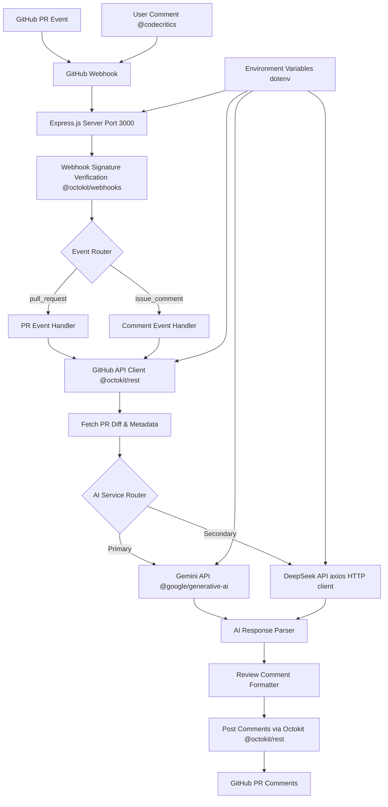

# Tech Context: Code Critics

## 1. Core Technologies
- **Runtime**: Node.js 22.x
  - **Reason**: Chosen for its event-driven nature, which is ideal for a webhook-based server. The vast npm ecosystem provides excellent tools for building this application.
- **Language**: TypeScript
  - **Reason**: Provides static typing, improving code quality, maintainability, and developer experience, which is crucial for a project dealing with complex API structures.

## 2. Key Libraries & APIs
- **GitHub Integration**: `@octokit/rest`
  - **Purpose**: The official GitHub REST API client for Node.js. It will be used for all interactions with GitHub, such as posting comments and checking PR statuses.
- **Webhook Framework**: `@octokit/webhooks`
  - **Purpose**: Handle GitHub webhook events with proper signature verification.
- **Web Server**: Express.js
  - **Purpose**: To build the webhook server endpoint. It's robust, well-documented, and easy to set up.
- **AI Integration**: 
  - **Gemini**: `@google/generative-ai` (Primary - free tier)
  - **DeepSeek**: `axios` for HTTP client (Secondary - cheap alternative)
  - **Purpose**: To make API calls to the chosen AI service. Gemini is default, DeepSeek as backup.
- **Environment Variables**: `dotenv`
  - **Purpose**: To load environment variables from a `.env` file into `process.env`, which is standard practice for managing configuration and secrets in development.

## 3. Development Environment

### **Nix-Shell Encapsulation Strategy**
- **Philosophy**: Complete OS isolation - ALL project dependencies are encapsulated within nix-shell
- **Goal**: Keep the host OS completely clean from project-specific tools and dependencies
- **Environment Management**: Nix Shell (`shell.nix`)
  - **Purpose**: Provides a reproducible, isolated development environment
  - **Includes**: Node.js 22.x, Yarn Berry (v4+)
  - **Isolation**: No global installations required on host system

### **Package Management (Encapsulated)**
- **Package Manager**: Yarn (v4+, via Corepack in nix-shell)
  - **Purpose**: Manage project dependencies within the isolated environment
  - **Version**: Pinned in `package.json` (`"packageManager": "yarn@4.9.2"`)
  - **Access**: All tools accessed via `yarn <command>` within nix-shell

### **Development Tools (All Encapsulated)**
- **Vercel CLI**: Installed as dev dependency (`vercel@44.2.7`)
  - **Access**: `yarn vercel <command>` (never installed globally)
  - **Purpose**: Deployment and local development server
- **TypeScript**: Project dependency, accessed via `yarn tsc`
- **Testing**: Vitest via `yarn test`
- **Linting**: ESLint via `yarn lint`
- **Formatting**: Prettier via `yarn format`
- **Local Development**: `yarn dev` for ts-node execution

### **Webhook Testing (Future Encapsulation)**
- **Local Webhook Tunneling**: Cloudflare Tunnel (`cloudflared`)
  - **Current**: May need global installation
  - **Future Goal**: Encapsulate in nix-shell if possible
  - **Purpose**: Expose local development server for webhook testing

### **Environment Activation**
```bash
# Enter isolated environment
cd /home/yuda/project/code-critics
nix-shell

# All commands run within isolated environment
yarn install
yarn dev
yarn vercel --version
yarn build
```

## 4. Authentication
- **GitHub**: Personal Access Token (PAT) stored in `.env` as `GITHUB_TOKEN`
- **Webhook Security**: Webhook secret stored as `WEBHOOK_SECRET` for signature verification
- **AI Service**: API Keys stored as OS environment variables:
  - `GEMINI_API_KEY` (Primary - free tier preferred)
  - `DEEPSEEK_API_KEY` (Secondary - cheap alternative)
- **Local Development**: Optional `PORT` variable (defaults to 3000)
- **Deployment**: For production, secrets will be managed via Vercel environment variables

## 5. Development Workflow
- **Version Control**: GitFlow branching strategy
  - `main`: Production-ready code. Only accepts merges from `release/*` and `hotfix/*`
  - `develop`: Main development branch. All `feature/*` branches are based on and merged back into `develop`
  - `feature/[issue-id]-description`: For new features
- **Commits**: Follow Conventional Commits specification
  - Format: `type(scope): description` (e.g., `feat(api): add webhook signature validation`)
  - Commits should be small, atomic, and represent a single logical change
- **Pull Requests**: All changes to `develop` and `main` must go through a PR with clear descriptions

## 6. Testing Strategy
- **Framework**: Vitest for unit and integration tests
- **Configuration**: `vitest.config.ts` with Node.js environment, globals enabled, and coverage reporting (text + lcov)
- **Priority**: Write tests for critical logic, especially API interactions, webhook processing, and business logic
- **Coverage**: Test success cases, error conditions, and edge cases
- **AI Testing**: Mock AI responses for consistent testing scenarios

## 7. Deployment Configuration
- **Platform**: Vercel serverless functions
- **Vercel CLI**: Version 44.2.7 (installed as dev dependency)
  - **Access**: `yarn vercel <command>` within nix-shell
  - **Authentication**: `yarn vercel login`
  - **Deployment**: `yarn vercel deploy`
  - **Local Development**: `yarn vercel dev` for local serverless testing
- **Environment**: Production secrets managed via Vercel environment variables
- **Local Development**: Uses Cloudflare Tunnel for webhook testing
- **Cold Start**: 1-3 second delays acceptable for personal use case 

## 8. Technology Workflow Diagram



### Technology Positioning:

**🟢 Express.js**: 
- **Position**: Entry point and web server framework
- **Role**: Receives webhooks, routes requests, handles HTTP layer

**🔵 @octokit/rest**: 
- **Position**: GitHub API communication layer
- **Role**: Fetches PR data, posts review comments back to GitHub

**🔵 @octokit/webhooks**: 
- **Position**: Security and event validation layer
- **Role**: Verifies webhook signatures, parses GitHub events

**🟠 @google/generative-ai**: 
- **Position**: Primary AI processing layer
- **Role**: Analyzes code diffs, generates review feedback

**🔴 axios**: 
- **Position**: Secondary AI HTTP client
- **Role**: Makes HTTP requests to DeepSeek API (backup AI service)

**🟣 dotenv**: 
- **Position**: Configuration layer
- **Role**: Loads environment variables (tokens, API keys, secrets)

## 9. Editor Integration
- When using Yarn Plug'n'Play (PnP), editors like VS Code or Cursor may not recognize dependencies by default.
- To enable TypeScript and ESLint support, run:
  ```
  yarn dlx @yarnpkg/sdks vscode
  ```
- This generates SDK files for the editor, resolving 'Cannot find module' errors in TypeScript and ESLint.
- Reload the editor after running the command. 